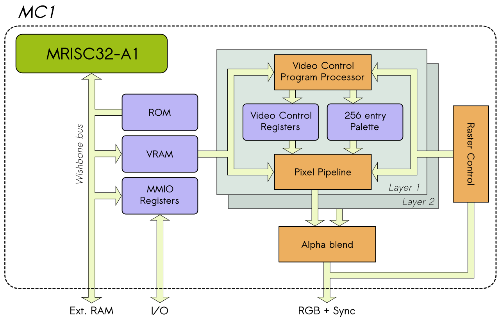
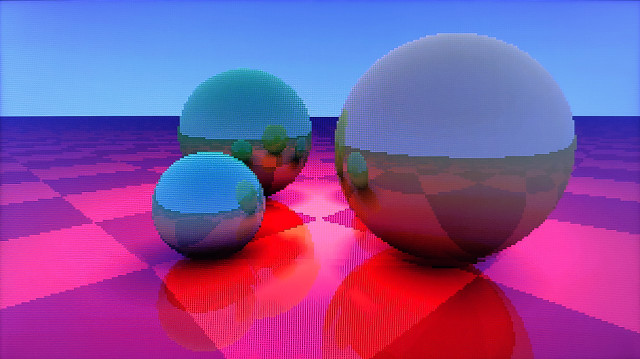

MC1 is a compact computer intended for FPGA:s, based on the [MRISC32-A1](https://github.com/mrisc32/mrisc32-a1) soft microprocessor.

## Architecture

The artchitecture is based around a tightly integrated and flexible video subsystem, which shares memory with the CPU.

The shared video RAM (VRAM) has two memory ports - one dedicated to the CPU and one dedicated to the video logic. This enables single-cycle access for both, and the CPU and the video logic can run at different frequencies.

### CPU

The CPU is a full MRISC32-A1, with support for floating point and vector operations.

Connected to the CPU are on-chip ROM and RAM memories. The ROM holds the boot code (in lack of external flash memory or similar, it contains the entire program/system code). Furthermore, external RAM (such as DRAM or SRAM) can be accessed, provided that a suitable Wishbone compatible memory controller is added (depending on which FPGA board you are targeting).

### Video

The video logic produces 24-bit RGB output and horizontal and vertical sync signals in 1920x1080 (1080p), suitable for VGA, DVI and HDMI interfaces, for instance.

One key feature of the video logic is that it has a programmable video control processor that runs in sync with the raster signals, making it possible to get the most out of limited memory resources while offloading the CPU for certain tasks.

Examples of things that a video control program can accomplish are:
* Control things like the vertical and horizontal resolution and the color mode on a per-line basis.
* Control the color palette on a per-line basis.
* Vertical and horizontal mirroring.
* Vertical and horizontal repeating of patterns.

This means that it is possible to mix resolutions and color modes in a single frame, and you can fill the screen with rich colors and high resolution content even with very limited video RAM resources.

For more details, see the [video logic documentation](docs/video_logic.md).

### I/O

Primitive I/O, such as reading buttons and switches and writing to leds and seven-segment displays, is provided as memory mapped I/O (see [MMIO](docs/mmio.md)), directly accessible for the CPU.

## Operating system

No operating system is planned at this point. There will be libraries of helper routined (e.g. for I/O and timing) that can be statically linked to MC1 binaries.

Once file loading capabilities are implemented, the ROM code will be able to load a program binary into RAM, and all system control is transfered to the loaded program (so it's essentially a two-stage boot).

## Planned features

The following things are not yet implemented, but planned:

* CPU:
  * Interrupt signals from the video logic (e.g. VSYNC), once interrupt logic has been added to the MRISC32.
* Video:
  * Two image planes (the top layer is alpha-blended on top of the bottom layer).
* Audio:
  * Some sort of high quality audio DMA, integrated with the video logic (sharing the same RAM read port).
* Memory:
  * Support for off-chip RAM (e.g. DRAM or SRAM) - probably with an on-chip L2 cache.
* I/O:
  * A Micro SD interface to read programs and data, and perhaps an interface for mouse/keyboard (e.g. PS/2).
